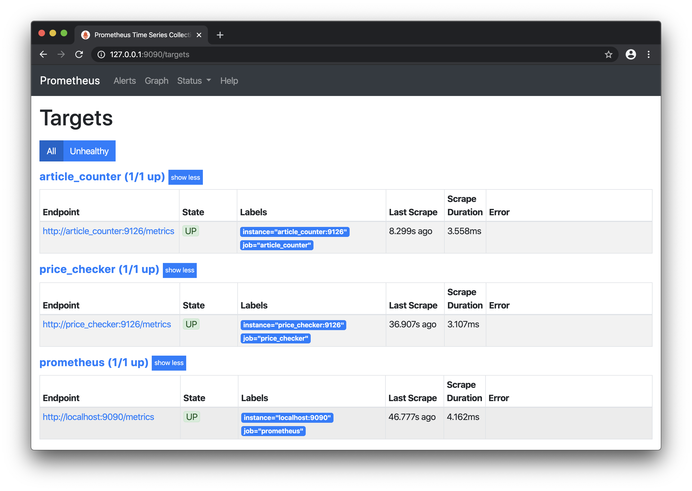

# Crypto Asset's Publicity and Price Trend Visualisation

## Description

This is an experiment in plotting an asset's publicity alongside its price action.  

Publicity is measured by counting the number of articles featuring the asset's symbol at a given time.  

Articles are collected from the [CryptoPanic.com](https://cryptopanic.com/) news aggregator, prices from [Coingecko.com](https://www.coingecko.com/en).  

The collected data is exported as [Prometheus](https://prometheus.io) time series and visualised using [Grafana](https://grafana.com).

## Requirements

* Linux environment
* Docker
* Docker Compose
* CryptoPanic.com [API](https://cryptopanic.com/developers/api/) credentials

## Setup

### Clone the repo

Clone this repository and switch to the resulting directory.

**Note:** The rest of the shell commands on this page assume the cloned `asset_trends` is your _working directory_.

Ensure the `grafana.db` file is writeable:

```bash
$ chmod 666 conf/grafana.db
```


### Build and Run

1. Put your CryptoPanic API token in a `Docker Compose` environment file (`.env`)

    ```bash
    # CryptoPanic API endpoint and authentication token
    NEWS_API_TOKEN=<< YOUR_API_TOKEN >>
    ```

2. Run docker-compose which will build the docker image and start the necessary containers

    ```bash
    $ docker-compose up -d
    Creating network "asset_trends_default" with the default driver
    Creating volume "asset_trends_prometheus_data" with default driver
    ...
    << OMITTED FOR BREVITY >>
    ...
    Creating asset_trends_grafana_1         ... done
    Creating asset_trends_prometheus_1      ... done
    Creating asset_trends_article_counter_1 ... done
    Creating asset_trends_price_checker_1   ... done
    ```

    **Note:** Enable `privileged` mode for the `prometheus` container if it fails to start,  
    logging a `panic: syscall.Getrlimit failed: operation not permitted` error.

3. Verify the service endpoints

    ```bash
    % docker-compose ps
                  Name                           Command               State           Ports
    ------------------------------------------------------------------------------------------------
        asset_trends_article_counter_1   pipenv run count_articles        Up
        asset_trends_grafana_1           /run.sh                          Up      0.0.0.0:3000->3000/tcp
        asset_trends_price_checker_1     pipenv run check_prices          Up
        asset_trends_prometheus_1        /bin/prometheus --config.f ...   Up      0.0.0.0:9090->9090/tcp
    ```

## Usage

### Access the dashboards

The above `docker-compose ps` output shows Prometheus listening on port `9090` and Grafana on `3000`.

After a minute you should see the Prometheus `targets` reported as `UP` at `http://127.0.0.1:9090/targets`:



Under the `Graph` tab you should be able to find the `asset` time series:


Finally arriving at `http://127.0.0.1:3000` you should be greeted by the `Grafana` login page (user: `admin`, password: `admin`):


The _Trends_ dashboard can be found on the homepage:


And it looks like this:


The first two panels work with a selection from a subset of all available assets, controlled via the `asset` drop-down menu visible outside of _Kiosk_ mode.

The _Overview_ panel incorporates all available assets (more details below).


## In Detail

Config variables are set in `src/config.py` with the exception of `NEWS_API_TOKEN` which is sourced from a private `.env` file.

The workflow begins with `src/count_articles.py` which:

* Collects all items found at the `/posts` endpoint of the CryptoPanic.com API via `get_articles`
* The collection is then passed onto `inspect_articles` for processing
* A _Summary_ of attributes is generated for each item in the collection, most importantly any `currency` labels that it might contain.  
    The `currencies` (i.e. `assets`) are the only attribute of interest at this stage. The rest might become useful in a future version of the script.
* The number of times each `currency` occurs is then exported as the `asset_articles_total` metric

In parallel, `src/check_prices.py` polls for price changes of a selected number of assets via the Coingecko.com `/simple/price` API endpoint, exporting the price data as the `asset_price_usd` metric.  

The reason for only checking a selected number of assets is that the data from CryptoPanic may contain assets not yet recognized on exchanges, i.e. no price data can be obtained for them.

These might still be interesting to observe in terms of their publicity, thus the extra _Overview_ panel on the dashboard.
